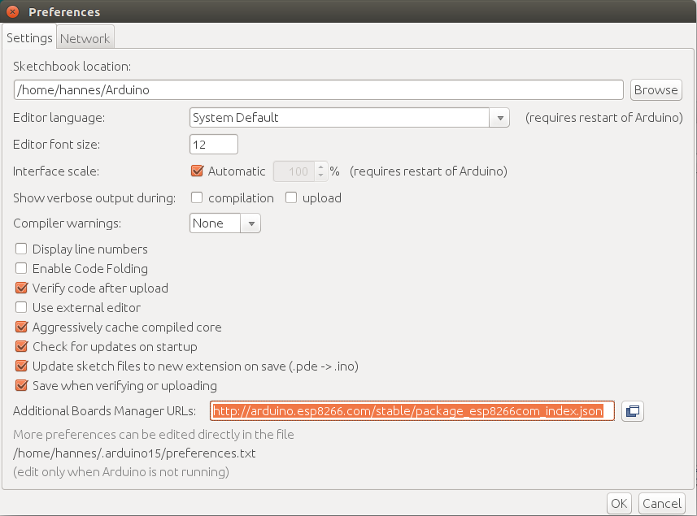
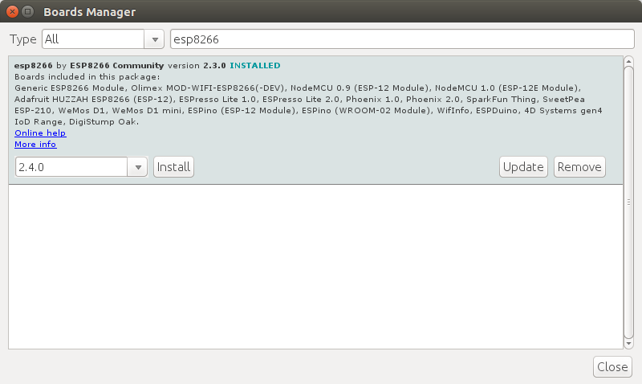

Mätstationens programkod ("firmware") finns färdigt att ladda ner, men den behöver överföras till NodeMCU som är den delen som exekverar mjukvaran.
Innan vi kan köra igång med överföringen ("flasha") behöver vi installera drivrutiner - detta gäller enbart Windows och MacOS. Linuxdistributioner brukar komma med allt som behövs.

  <h6>Vill du bygga tillsammans med andra?</h6>
  
Vi försöker hålla workshops med regelbundna mellanrum, håll koll på <a href="https://www.facebook.com/groups/luftbubblan/events/" target="_blank">Luftbubblans evenemangssida</a> för att få info om var och när nästa luftdata-workshop går av stapeln.

## Steg 1: Installera "usb2serial" drivrutiner

För att kunna kommunicera med NodeMCU behövs s.k. usb2serial drivrutiner. Beroende på vilken NodeMCU-version du har köpt behöver du olika drivrutiner (återigen, detta gäller inte Linux då detta operativsystem redan har rätt drivrutiner):

  - För NodeMCU v3 behövs CH340G-drivrutiner som finns för [Windows](http://www.arduined.eu/files/CH341SER.zip) och [Mac](https://github.com/adrianmihalko/ch340g-ch34g-ch34x-mac-os-x-driver).
  - Om du mot förmodan skulle ha en äldre NodeMCU v2 så behöver du ladda ner drivrutiner för CP2102 som du hittar [här](https://www.silabs.com/products/mcu/Pages/USBtoUARTBridgeVCPDrivers.aspx).
  
Om du inte vet vilken NodeMCU-version du har köpt kan du kolla på NodeMCUs undersida, ibland finns det information angiven om chip-sorten och/eller drivrutiner som behövs. 

## Steg 2: Installera Arduino-mjukvara

  1. Ladda ner och installera Arduino-mjukvaran från [`https://www.arduino.cc/en/Main/Software`](https://www.arduino.cc/en/Main/Software).
  2. Starta Arduino IDE och öppna inställningarna via **File** -> **Preferences**.
  3. I fältet "Additional Board Manager URLs" klistra in följande URL: `http://arduino.esp8266.com/stable/package_esp8266com_index.json` (se skärmdump nedan). 
  4. Öppna "Boards Manager" via **Tools** -> **Board: ...** -> **Boards Manager...**
  5. Sök efter "esp8266" och installera "esp8266 by ESP8266 Community" (se skärmdump nedan). 

## Steg 3: Överföra firmware

Ladda ner firmware från [`https://www.madavi.de/sensor/update/data/latest_en.bin`](https://www.madavi.de/sensor/update/data/latest_en.bin) och koppla din NodeMCU till datorn med en USB 2.0-kabel.

Du kan undvika eventuella problem vid uppkoppling eller överföring genom att använda en USB 2.0-port (USB 3.0 kan ge problem med Windows) och en kabel som inte är längre än 1 meter.
  

  <h6>Ta reda på rätt "port"</h6>
  
Oavsett operativssystem behöver du ta reda på vilken port drivrutinen använder när den kommunicerar med din NodeMCU. Porten behöver du sedan för att kunna exekvera kommandon nedan för att överföra firmwaran.

  
Öppna Arduino IDE och leta dig till menyn <strong>Tools</strong> -> <strong>Port</strong> där det direkt i menyn listas alla tillgängliga portar. Porten som NodeMCU är ansluten till brukar kunna ses direkt. Om det finns flera portar och det inte framgår tydligt vilken som används av NodeMCU så går det bra att välja en port för att sedan köra <strong>Tools</strong> -> <strong>Get Board Info</strong>. Om rätt port är vald så dyker det upp information vid VID och PID.

Du bör nu stänga Arduino IDE, den behövdes enbart för att installera mjukvara specifik för chippet ESP8266 som NodeMCU bygger på. Om du inte stänger Arduino IDE så kan den komma i konflikt med överföringsverktyget nedan.
    
### Windows

Öppna terminalen (`cmd.exe`) och exekvera <code style="white-space: normal;">%USERPROFILE%\AppData\Local\Arduino15\packages\esp8266\tools\esptool\0.4.9\esptool.exe -vv -cd nodemcu -cb 57600 -ca 0x00000 -cp COM11 -cf sökväg\latest_en.bin</code> (anpassa porten efter `-cp` och sökvägen till firmware efter `-cf`).
    
### Linux

Öppna terminalen och exekvera <code style="white-space: normal;">~/.arduino15/packages/esp8266/tools/esptool/0.4.9/esptool -vv -cd nodemcu -cb 57600 -ca 0x00000 -cp /dev/ttyUSB0 -cf sökväg/latest_en.bin</code>. Du måste anpassa porten efter `-cp` och sökvägen till firmware efter `-cf`.

Eventuellt behöver kommandot ovan exekveras som `root` t.ex. via `sudo <kommando>`.

  <h6>Vill du ta bort en konfiguration från NodeMCU?</h6>
  
För Linux finns det <a href="https://github.com/opendata-stuttgart/sensors-software/tree/master/utils/flash" target="_blank">ett skript på GitHub</a> för att ta bort en befintlig konfiguration från NodeMCU.

  
### Mac

Öppna terminalen och exekvera <code style="white-space: normal;">~/Library/Arduino15/packages/esp8266/tools/esptool/0.4.9/esptool -vv -cd nodemcu -cb 57600 -ca 0x00000 -cp /dev/cu.wchusbserial1410 -cf sökväg/latest_en.bin</code>. Du måste anpassa porten efter `-cp` och sökvägen till firmware efter `-cf`.

Eventuellt behöver kommandot ovan exekveras som `root` t.ex. via `sudo <kommando>`.


---
#### Nästa steg: [{{ page.pagination.next.name }}]({{ page.pagination.next.link }})
